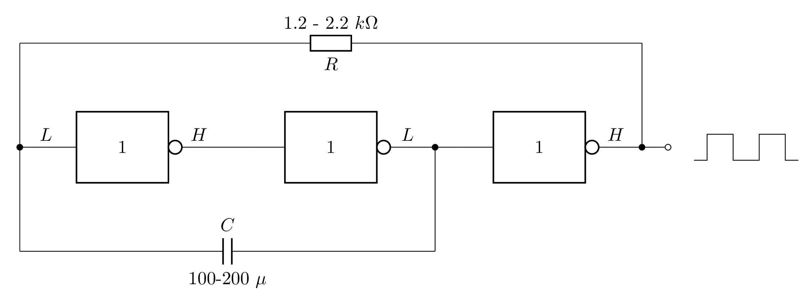

# Astabilní klopný obvod
Schéma pro astabilní (symetrický a nesymetrický) klopný obvod používaný v předmětu CIT (číslicová technika)

# Nesymetrický

<picture style="background-color:white !important">
  <source media="(prefers-color-scheme: dark)" srcset="KO_astabil_nesym.png" style="background-color:white">
  <source media="(prefers-color-scheme: light)" srcset="KO_astabil_nesym.png">
  
</picture>

