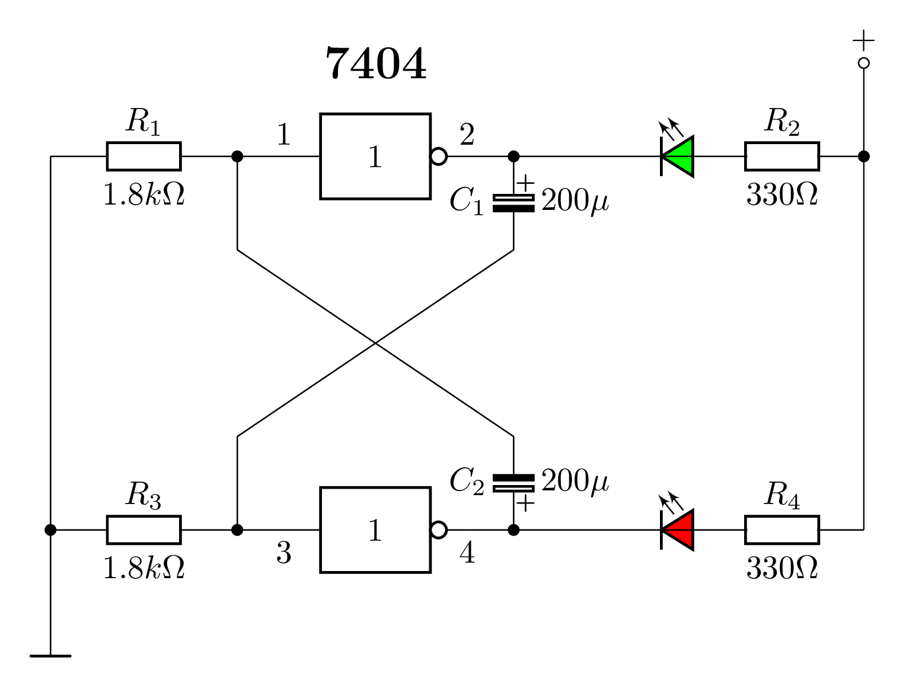

# Astabilní klopný obvod
Schéma pro astabilní (symetrický a nesymetrický) klopný obvod používaný v předmětu CIT (číslicová technika)

# Nesymetrický
<picture>
  <source media="(prefers-color-scheme: dark)" srcset="KO_astabil_nesym.png" style="background-color:white">
  <source media="(prefers-color-scheme: light)" srcset="KO_astabil_nesym.png">
  
</picture>

# Symetrický
<picture>
  <source media="(prefers-color-scheme: dark)" srcset="KO_astabil_sym_color.png" style="background-color:white">
  <source media="(prefers-color-scheme: light)" srcset="KO_astabil_sym_color.png">
  
</picture>
